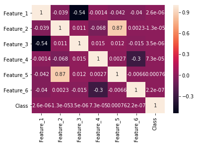
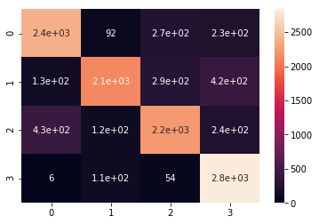

# Classify_SVM
Galvanic Skin Response (GSR) &amp; Photoplethysmogram (PPG) data classification using Support Vector Machine (SVM) classifier


```python
import pandas as pd
import numpy as np
from sklearn import svm
import seaborn as sns
import matplotlib as plt
```


```python
df = pd.read_excel(r"C:\Users\Asus\Desktop\feature_set.xlsx")
```


```python
sns.heatmap(df.corr(), annot=True);
```





```python
X = df.drop(['Class'], axis = 1)
y = df['Class']
df['Class'].value_counts()
```


    3    9999
    2    9999
    1    9999
    0    9999
    Name: Class, dtype: int64


```python
from sklearn.model_selection import train_test_split
X_train, X_test, y_train, y_test = train_test_split(X, y, test_size = 0.3)
```


```python
from sklearn.svm import SVC
svc_model = SVC()
```


```python
comptd = svc_model.fit(X_train, y_train);
```


```python
comptd.score(X_test, y_test)
```


    0.800650054171181


```python
y_predict = svc_model.predict(X_test)
```


```python
from sklearn.metrics import classification_report, confusion_matrix
```


```python
cm = np.array(confusion_matrix(y_test, y_predict, labels=[0,1,2,3]))
confusion = pd.DataFrame(cm, index=['0', '1', '2', '3'],columns=['0', '1', '2', '3'])
confusion
```


<div>
<style scoped>
    .dataframe tbody tr th:only-of-type {
        vertical-align: middle;
    }

    .dataframe tbody tr th {
        vertical-align: top;
    }

    .dataframe thead th {
        text-align: right;
    }
</style>
<table border="1" class="dataframe">
  <thead>
    <tr style="text-align: right;">
      <th></th>
      <th>0</th>
      <th>1</th>
      <th>2</th>
      <th>3</th>
    </tr>
  </thead>
  <tbody>
    <tr>
      <th>0</th>
      <td>2398</td>
      <td>92</td>
      <td>270</td>
      <td>229</td>
    </tr>
    <tr>
      <th>1</th>
      <td>131</td>
      <td>2133</td>
      <td>288</td>
      <td>424</td>
    </tr>
    <tr>
      <th>2</th>
      <td>431</td>
      <td>115</td>
      <td>2241</td>
      <td>239</td>
    </tr>
    <tr>
      <th>3</th>
      <td>6</td>
      <td>113</td>
      <td>54</td>
      <td>2835</td>
    </tr>
  </tbody>
</table>
</div>


```python
sns.heatmap(confusion, annot=True)
```


    <matplotlib.axes._subplots.AxesSubplot at 0x1802669f630>





```python
print(classification_report(y_test, y_predict))
```

                  precision    recall  f1-score   support
    
               0       0.81      0.80      0.81      2989
               1       0.87      0.72      0.79      2976
               2       0.79      0.74      0.76      3026
               3       0.76      0.94      0.84      3008
    
       micro avg       0.80      0.80      0.80     11999
       macro avg       0.81      0.80      0.80     11999
    weighted avg       0.81      0.80      0.80     11999
    
    
